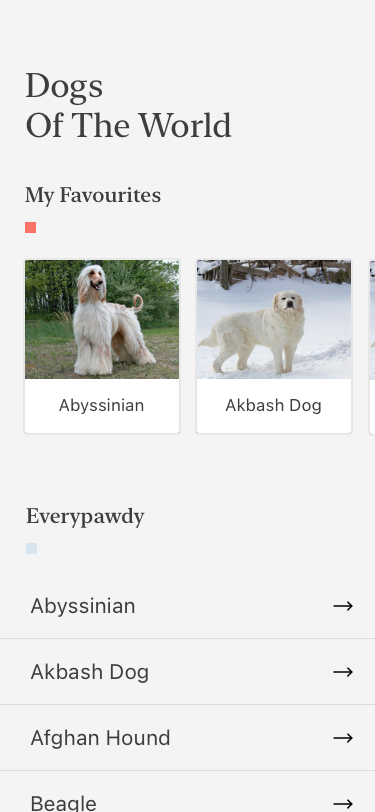
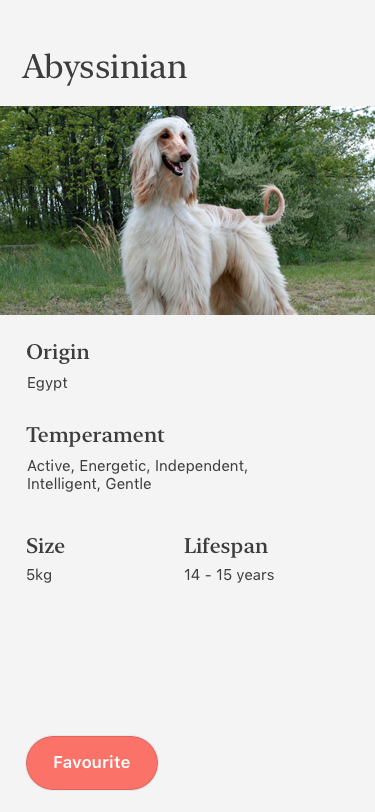

We are happy you're interested in an engineering position at Flipdish!

### About This Challenge
We want to see how you construct software, but we also know that you're busy. So, rather than ask you to build something from scratch, we want you to take whatever time is reasonable and refactor some of the code in this application. Just make it better, in literally any way that you see fit.

It doesn't matter how long you spend on improving it! You could spend 5 minutes, or 5 hours -- the amount of time is totally up to you. It'll really help us understand your perspectives on software when we see how you improve existing code that you haven't encountered before. Feel free to refactor, change, improve, rewrite or optimize any part of the application at all.

### About The app

The app is a very simple List / Detail client for [The Dog API](https://docs.thedogapi.com/). It works (for the most part) but, as you'll quickly notice, the code has a lot of issues. Let's make it better!

##### Functionality

- The basic premise is to fetch a list of Dogs from the API, and render them in a list.
- Each list item can be opened for a detail view and from there the user can choose their favourite Perros 🦮🐕‍🦺🐕🐩.
- There's a section at the top of the list view with quick access to the user's favourited Dogs.

See attached screenshots for how the app <em>should</em> look.

***

##### Notes

- Use any relevant third party libraries you wish, but please include your reasoning for doing so in your change description (see below for more details)
- Feel free to add any additional functionality as, if and when you see fit.
- Show off your skills and have some fun with it.

#### Additional Info

<em>The Dog API</em> API key: `081c16a8-75b7-44ae-b6db-9fd93bf68903`

### Also...
* The application is deliberately written to be "not very clean code". It should not be viewed as representative of acceptable code at Flipdish (it isn't).
* This README is deliberately sparse, so you'll have to read the code to truly understand what the application does.
* Please keep track of the amount of time you do spend working on cleaning this code up. We'll want to know this when we review your solution, because it'll help us set our expectations appropriately.

### Submitting your work
* We work each day in GitHub, so we want to review your code in GitHub too. However, please do NOT submit a Pull Request to this repository because it will become visible for other candidates (or even your current employer) to see your work.
* Instead, please do the following:
  - Create a [private repository](https://docs.github.com/en/free-pro-team@latest/github/creating-cloning-and-archiving-repositories/about-repository-visibility) under your own GitHub account.
  - Commit all of the code from this repository to the `master`branch in your new private repository as a starting point.
  - Create a new branch in your private repository.
  - Commit your changes and refactoring work to the new branch.
  - Create a [Pull Request](https://docs.github.com/en/free-pro-team@latest/github/collaborating-with-issues-and-pull-requests/about-pull-requests) based on your branch.
  - Include a description of what you changed in the Pull Request, and how long you spent on the work.
  - Invite the GitHub user `flipdish-reviewers` to be a [collaborator](https://docs.github.com/en/free-pro-team@latest/github/setting-up-and-managing-your-github-user-account/inviting-collaborators-to-a-personal-repository) on your private repository.
  - Email to let us know that the PR is ready for review by our team.

Good luck with the assignment, and have fun with it!
